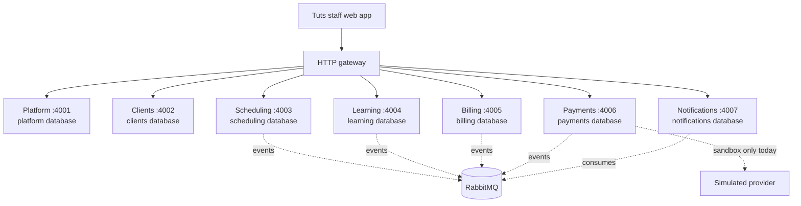

# Tuts

Tuts is a composable tutoring-business workspace. Its local preview brings together seven independently running domain services, each with its own API, migrations, and PostgreSQL database. PostgreSQL row-level security, signed gateway context, and RabbitMQ provide the service and tenant boundaries.

The current product is a local development preview with a staff web app. Architecture documents describe the contracts and extension workflow for this system; they include planned capabilities as well as implemented ones. The status list below is the source of truth for what is delivered today.

## What works today

| Area | Delivered | Not delivered yet |
| --- | --- | --- |
| Platform | Sign-in, business workspaces, an owner membership created with each workspace, starter feature access, workspace identity settings | Inviting or adding other staff, student/parent portal, production subscription administration |
| Clients | Tenant-scoped student and payer records | Student/parent portal access and import/contact delivery |
| Scheduling | Staff session scheduling and lifecycle actions | Student self-service booking |
| Learning | Staff assignment creation and progress records | Resource file upload and student portal access |
| Billing | Staff invoice creation, issue, and payment allocation | Automatic invoicing from completed sessions and recurring billing |
| Payments | Explicitly labeled local sandbox attempts and simulated confirmations | Live Stripe, PayPal, or bank integrations; no real money is moved |
| Notifications | Durable in-app/email notification intents with `queue_only` delivery status | Sending email or SMS, delivery confirmation, and student-facing notifications |

There is no cloud deployment configuration or production operation in this repository. Provider credentials, country-specific bank integrations, production entitlement setup, and deployment are separate future work. See [payment provider contracts](docs/architecture/payments.md) for the intended adapter model.

## Architecture



Each service owns its database, migrations, and API. PostgreSQL row-level security and signed gateway JWTs scope business requests. RabbitMQ carries cross-domain events. Stripe, PayPal, and bank provider connections are future work; the only available payment provider is the local sandbox.

## Quickstart

Prerequisites: Node.js 22 or newer, pnpm 10, and Docker with Docker Compose.

From the repository root:

```sh
pnpm install
pnpm setup:local
pnpm infra:up
pnpm build
pnpm dev
```

`pnpm setup:local` creates an ignored `.env` with local credentials and signing keys. Keep it on your machine. Account signup requires a password of at least 12 characters and creates an owner membership for the new workspace. `pnpm infra:up` starts the local PostgreSQL server and RabbitMQ. `pnpm dev` runs the seven services, gateway, and web app; leave it running while using the preview.

- Web app: [http://localhost:3000](http://localhost:3000)
- Gateway: [http://localhost:8080](http://localhost:8080)
- RabbitMQ management: [http://localhost:15673](http://localhost:15673)

Stop the app with Ctrl-C, then stop infrastructure with `pnpm infra:down`. The first setup provisions databases and roles when the PostgreSQL volume is initialized. The setup script preserves an existing `.env`; changing generated database passwords later does not rotate passwords in an already initialized database. To start over, `docker compose down -v` deletes all local PostgreSQL and RabbitMQ data, including workspaces and records.

## How features plug in

The web app composes business features through the gateway. A feature owns its business logic and data in its service; frontend navigation is only a presentation choice, while the gateway and service enforce access. For the end-to-end workflow, start with [service boundaries and app composition](docs/architecture/services.md#composition), then follow its [feature addition steps](docs/architecture/services.md#add-a-feature). The [HTTP](docs/architecture/http.md), [events](docs/architecture/events.md), [tenant isolation](docs/architecture/tenancy.md), and [implementation](docs/architecture/implementation.md) documents define the shared contracts.

Read the contracts before extending a service:

1. [Service boundaries and feature composition](docs/architecture/services.md)
2. [HTTP authentication and communication](docs/architecture/http.md)
3. [Events, retries, and consistency](docs/architecture/events.md)
4. [Tenant isolation and customization](docs/architecture/tenancy.md)
5. [Payments and provider capabilities](docs/architecture/payments.md)
6. [Contributor implementation contract](docs/architecture/implementation.md)
7. [Architecture decisions](docs/architecture/decisions.md)

These pages preserve the intended architecture and clearly scoped future requirements; they do not assert that every described capability is implemented. Check **What works today** above and each service README for current service behavior.

## Stack

TypeScript, Next.js and React, seven NestJS service processes, PostgreSQL with a separate database and restricted role per service, RabbitMQ, and Docker Compose for local infrastructure. The local Compose environment shares one PostgreSQL server while keeping the service databases and credentials separate. Payment simulation is limited to the local development environment.
