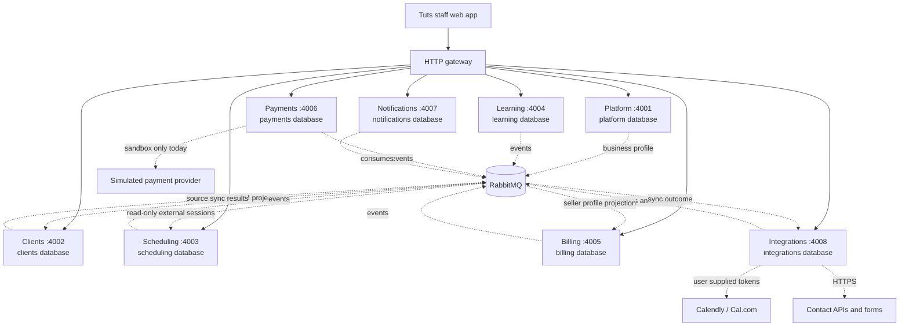

# Tuts

Tuts is a composable tutoring-business workspace. Its local preview brings together eight independently running domain services, each with its own API, migrations, and PostgreSQL database. PostgreSQL row-level security, signed gateway context, and RabbitMQ provide the service and tenant boundaries.

The current product is a local development preview with a staff web app. Architecture documents describe the contracts and extension workflow for this system; they include planned capabilities as well as implemented ones. The status list below is the source of truth for what is delivered today.

## What works today

| Area | Delivered | Not delivered yet |
| --- | --- | --- |
| Platform | Sign-in, business workspaces, an owner membership created with each workspace, editable business profile and address, logo, four-color workspace palette | Inviting or adding other staff, student/parent portal, production subscription administration |
| Clients | Tenant-scoped student and payer records; mapped CSV and `.xlsx` import with preview/commit; connected-source contact intake | Student/parent portal access |
| Scheduling | Sessions UI displays read-only Calendly/Cal.com sessions; legacy local session APIs remain | UI-based local session creation/editing and provider booking actions; student self-service booking |
| Learning | Staff assignments, progress records, and private persistent-disk resource uploads up to 20 MiB | Student/parent portal access and cloud object storage |
| Billing | Staff invoice creation, issue, and payment allocation; invoice snapshots include business seller profile and logo | Automatic invoicing from completed sessions and recurring billing |
| Payments | Explicitly labeled local sandbox attempts and simulated confirmations | Live Stripe, PayPal, or bank integrations; no real money is moved |
| Notifications | Durable in-app/email notification intents with `queue_only` delivery status | Sending email or SMS, delivery confirmation, and student-facing notifications |
| Integrations | Token-based Calendly/Cal.com polling, HTTPS JSON contact pulls, authenticated form webhooks, durable CRM/session sync | OAuth app connections; businesses must supply credentials and verify their own connection before use |

There is no cloud deployment configuration or production operation in this repository. OAuth app connections, production payment providers, country-specific bank integrations, student/parent portal access, production entitlement setup, and deployment are future work. The real provider integrations are implemented, but require each business to supply its own credentials; their live behavior has not been verified as part of this implementation. See [connector protocols](docs/architecture/connectors.md), [payment provider contracts](docs/architecture/payments.md), and the [service status list](#what-works-today).

## Architecture



Each service owns its database, migrations, and API. PostgreSQL row-level security and signed gateway JWTs scope business requests. RabbitMQ carries cross-domain events. The integrations service polls connected calendars and receives contacts, then the CRM and scheduling services own their projections. Payments still uses only the local sandbox.

## Quickstart

Prerequisites: Node.js 22 or newer, pnpm 10, and Docker with Docker Compose.

From the repository root:

```sh
pnpm install
pnpm setup:local
pnpm infra:up
pnpm build
pnpm dev
```

`pnpm setup:local` creates an ignored `.env` with local credentials and signing keys, and adds missing settings while preserving existing values. Keep it on your machine. Account signup requires an 8–128 character password and a confirmation in the UI; there are no composition rules. Creating a business workspace creates its owner membership. `pnpm infra:up` starts the local PostgreSQL server and RabbitMQ. `pnpm dev` runs the eight services, gateway, and web app; leave it running while using the preview.

For an existing checkout, use the same commands after pulling the update. Run `pnpm install` to update the workspace, then `pnpm setup:local` to add the integrations encryption key and database credential while preserving existing local settings. After starting infrastructure, run `docker compose exec -T postgres sh /tmp/palladium-init.sh` once; this idempotently provisions the new integrations role and database without resetting existing databases. Then build and start the development processes:

```sh
pnpm install
pnpm setup:local
pnpm infra:up
docker compose exec -T postgres sh /tmp/palladium-init.sh
pnpm build
pnpm dev
```

The integrations service needs `INTEGRATIONS_ENCRYPTION_KEY`, generated by `pnpm setup:local` as canonical base64 for 32 random bytes. Keep the key stable; changing it requires reconnecting providers whose credentials it encrypted.

- Web app: [http://localhost:3000](http://localhost:3000)
- Gateway: [http://localhost:8080](http://localhost:8080)
- RabbitMQ management: [http://localhost:15673](http://localhost:15673)

Stop the app with Ctrl-C, then stop infrastructure with `pnpm infra:down`. Fresh installations provision all service databases and roles when the PostgreSQL volume is initialized. The setup script preserves an existing `.env`; changing generated database passwords later does not rotate passwords in an already initialized database. `docker compose down -v` deletes all local PostgreSQL, RabbitMQ, and learning-upload data, including workspaces and records.

## How features plug in

The web app composes business features through the gateway. A feature owns its business logic and data in its service; frontend navigation is only a presentation choice, while the gateway and service enforce access. For the end-to-end workflow, start with [service boundaries and app composition](docs/architecture/services.md#composition), then follow its [feature addition steps](docs/architecture/services.md#add-a-feature). The [HTTP](docs/architecture/http.md), [events](docs/architecture/events.md), [tenant isolation](docs/architecture/tenancy.md), and [implementation](docs/architecture/implementation.md) documents define the shared contracts.

Read the contracts before extending a service:

1. [Service boundaries and feature composition](docs/architecture/services.md)
2. [HTTP authentication and communication](docs/architecture/http.md)
3. [Events, retries, and consistency](docs/architecture/events.md)
4. [Tenant isolation and customization](docs/architecture/tenancy.md)
5. [Payments and provider capabilities](docs/architecture/payments.md)
6. [Contributor implementation contract](docs/architecture/implementation.md)
7. [Architecture decisions](docs/architecture/decisions.md)
8. [Connector protocols, sync APIs, and event flow](docs/architecture/connectors.md)

These pages preserve the intended architecture and clearly scoped future requirements; they do not assert that every described capability is implemented. Check **What works today** above and each service README for current service behavior.

## Stack

TypeScript, Next.js and React, eight NestJS service processes, PostgreSQL with a separate database and restricted role per service, RabbitMQ, and Docker Compose for local infrastructure. The local Compose environment shares one PostgreSQL server while keeping the service databases and credentials separate. Payment simulation is limited to the local development environment.
