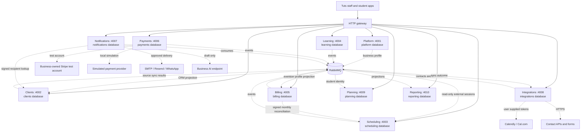

# Tuts

Tuts is a composable tutoring-business workspace. Its local preview brings together ten independently running domain services, each with its own API, migrations, and PostgreSQL database. PostgreSQL row-level security, signed gateway context, and RabbitMQ provide the service and tenant boundaries.

The hosted app runs at [tuts.palladiumscholars.com](https://tuts.palladiumscholars.com) on Cloudflare Pages/Workers, Neon PostgreSQL, Queues and private R2. Production has ten private domain Workers plus a gateway. Local development uses independent Node processes, PostgreSQL roles/databases and RabbitMQ. The container target remains an alternative.

**Documentation reviewed 10 October 2026:** start at the [documentation index](docs/README.md), [current system architecture](docs/architecture/system.md), [175-route API/schema inventory](docs/service-inventory.md), and [performance/security audit](docs/reviews/2026-10-10-platform-audit.md). The audit records measured evidence, open work and verification limits. Historical review files describe their own releases.

The deployed application baseline is `2a44213`. Account/data migration and recovery are documented in [the migration procedure](docs/data-migration.md); existing password hashes were preserved, browser sessions were not. The audit inspected live service settings/roles and ran synthetic local tests; it does not establish every hosted account/provider workflow.

Password recovery has request/reset pages, expiring single-use links, confirmation, session revocation and rate limits. **Automatic recovery and invitation email is disabled in the inspected production configuration.** A configured sender and actual delivery verification are still required. See [password recovery](docs/architecture/password-recovery.md).

## What works today

| Area | Implemented | Limits / provider setup |
| --- | --- | --- |
| Platform | Account recovery, business branding, scoped capability policy, invitations and student/guardian access | System email requires a configured sender; enterprise licensing/admin is deferred |
| Clients | Editable CRM, custom columns/imports, multiple related contacts/addresses, duplicate review/merges, groups and student cards | Name matches need review; portal-protected records cannot merge without a future revoke/unlock workflow |
| Scheduling | Calendar, Cal.com/Calendly sync, signed Cal.com webhook, explicit attendance and no-show status | Tutor configures booking link/API connection; webhook registration remains manual; ambiguous student matches require review |
| Learning | Private uploads/downloads, homework submission/review, student portal, selected Google Docs references | Google sharing remains external; no Google OAuth document creation |
| Billing | Prior-month completed-class billing, source-preserving CSV/XLSX/PDF history, work log, monthly/status filters, exact aggregates and immutable issued snapshots | Historical paid statuses are declarations; no OCR or automatic real charges |
| Payments | Existing Stripe test adapters and local simulation, clearly separate from confirmed collections | Live Stripe/PayPal/bank provider activation remains separate |
| Notifications | Durable campaigns and system invite/recovery sender adapter | Automatic system email unavailable until real sender configured; outbound campaigns disabled by default |
| Integrations | Calendar/contact connectors, safe student booking links and provider reconciliation | Customer credentials required; no new OAuth registrations |
| Planning | Multiple boards, whole-card drag, ordered background saves, profile-based application cycles, dated/versioned templates and explicit upgrades | Typical dates are planning defaults; institution/program/round details still require confirmation |
| Reporting | Business dashboard, batch student summaries, coverage/asOf, engagement/inactivity metrics, estimated activity and tagged Beacons links | Imported engagement uses unlinked names; incomplete-month churn is provisional; no direct Beacons conversion writes |

The [Cloudflare deployment guide](docs/cloudflare-deployment.md) describes separate private service Workers, PostgreSQL databases, Queues and private R2 uploads. Its adapter preserves the HTTP and event contracts. SMTP, arbitrary contact API pulls and custom AI endpoints require an additional safe egress adapter on Cloudflare; Cal.com, Calendly, Resend and WhatsApp use fixed provider endpoints. Production payments remain unavailable, and outbound messaging is disabled by default. The audit records public HTTP checks and local authenticated verification separately; hosted authenticated performance/provider delivery remain unverified in that audit. The earlier [Google Cloud container configuration](docs/deployment.md) remains an alternative and has not been provisioned.

OAuth app connections, production payment providers, country-specific bank integrations, paid subscription administration are future work. Provider integrations require each business to supply its own credentials; their live behavior has not been verified as part of this implementation. See [connector protocols](docs/architecture/connectors.md), [payment provider contracts](docs/architecture/payments.md), and the [service status list](#what-works-today).

## Architecture



Each service owns its database, migrations, and API. PostgreSQL row-level security and signed gateway JWTs scope business requests. RabbitMQ carries cross-domain events in the Node deployment; the Cloudflare adapter uses per-consumer Queues with the same contracts. The integrations service polls connected calendars and receives contacts, then the CRM and scheduling services own their projections. Payments creates test links in each business’s own Stripe test account; verified reconciliation flows into Billing through events. Notifications resolves selected CRM recipients over signed HTTP and owns its campaign queue.

## Quickstart

Prerequisites: Node.js 22 or newer, pnpm 10, and Docker with Docker Compose.

From the repository root:

```sh
pnpm install
pnpm setup:local
pnpm infra:up
pnpm build
pnpm dev
```

`pnpm setup:local` creates an ignored `.env` with local credentials and signing keys, and adds missing settings while preserving existing values. Keep it on your machine. Account signup requires an 8–128 character password and a confirmation in the UI; there are no composition rules. Creating a business workspace creates its owner membership. `pnpm infra:up` starts the local PostgreSQL server and RabbitMQ. `pnpm dev` runs the ten services, gateway, and web app; leave it running while using the preview.

For an existing checkout, use the same commands after pulling the update. Run `pnpm install` to update the workspace, then `pnpm setup:local` to add missing service keys and database credentials while preserving existing local settings. After starting infrastructure, run `docker compose exec -T postgres sh /tmp/palladium-init.sh` once; this idempotently provisions new service roles and databases without resetting existing databases. Then build and start the development processes:

```sh
pnpm install
pnpm setup:local
pnpm infra:up
docker compose exec -T postgres sh /tmp/palladium-init.sh
pnpm build
pnpm dev
```

Messaging needs `COMMUNICATIONS_ENCRYPTION_KEY` and defaults to `ALLOW_OUTBOUND_DELIVERY=false`; preview/approval and provider wiring are documented in [communications](docs/architecture/crm-communications.md). Keep its encryption key stable.

The integrations service needs `INTEGRATIONS_ENCRYPTION_KEY`, generated by `pnpm setup:local` as canonical base64 for 32 random bytes. Keep the key stable; changing it requires reconnecting providers whose credentials it encrypted.

- Web app: [http://localhost:3000](http://localhost:3000)
- Gateway: [http://localhost:8080](http://localhost:8080)
- RabbitMQ management: [http://localhost:15673](http://localhost:15673)

Stop the app with Ctrl-C, then stop infrastructure with `pnpm infra:down`. Fresh installations provision all service databases and roles when the PostgreSQL volume is initialized. The setup script preserves an existing `.env`; changing generated database passwords later does not rotate passwords in an already initialized database. `docker compose down -v` deletes all local PostgreSQL, RabbitMQ, and learning-upload data, including workspaces and records.

## How features plug in

The [system architecture](docs/architecture/system.md) and [security/performance review](docs/reviews/2026-10-10-platform-audit.md) explain current behavior and open work. The web app composes business features through the gateway. A feature owns its business logic and data in its service; frontend navigation is only a presentation choice, while the gateway and service enforce access. For the end-to-end workflow, start with [service boundaries and app composition](docs/architecture/services.md#composition), then follow its [feature addition steps](docs/architecture/services.md#add-a-feature). The [HTTP](docs/architecture/http.md), [events](docs/architecture/events.md), [tenant isolation](docs/architecture/tenancy.md), and [implementation](docs/architecture/implementation.md) documents define the shared contracts.

Read the contracts before extending a service:

1. [Service boundaries and feature composition](docs/architecture/services.md)
2. [HTTP authentication and communication](docs/architecture/http.md)
3. [Events, retries, and consistency](docs/architecture/events.md)
4. [Tenant isolation and customization](docs/architecture/tenancy.md)
5. [Payments and provider capabilities](docs/architecture/payments.md)
6. [Contributor implementation contract](docs/architecture/implementation.md)
7. [Architecture decisions](docs/architecture/decisions.md)
8. [Connector protocols, sync APIs, and event flow](docs/architecture/connectors.md)
9. [CRM columns and communications](docs/architecture/crm-communications.md)
10. [Monthly billing and dashboard](docs/architecture/monthly-billing.md)
11. [Password recovery and system email](docs/architecture/password-recovery.md)
12. [Student workspace and scoped capabilities](docs/architecture/student-workspace.md)

The student workspace expansion follows the [delivery tracker](docs/student-workspace-delivery.md).
The release is deployed on the existing Cloudflare/Neon/R2 installation.
Its architecture keeps feature permissions separate from role labels so future
enterprise provisioning can assign billing and teaching capabilities at different
account levels without changing service ownership. Enterprise administration is
not part of this release.

These pages preserve the intended architecture and clearly scoped future requirements; they do not assert that every described capability is implemented. Check **What works today** above and each service README for current service behavior.

The [live UI review](docs/ux-review.md) records usability fixes, manually exercised flows, and verification limits.

## Stack

TypeScript, Next.js and React, ten NestJS service processes, PostgreSQL with a separate database and restricted role per service, RabbitMQ, and Docker Compose for local infrastructure. The local Compose environment shares one PostgreSQL server while keeping the service databases and credentials separate. The Cloudflare target uses private Workers, Neon PostgreSQL, Queues and R2 while retaining the same domain boundaries. Payment simulation is limited to the local development environment.

Student access and the guided planning interface are documented in [learner access and planning](docs/architecture/learner-planning-ux.md). Billing and business analytics remain tutor workspace features.

## Maintenance and verification

Update contracts, service README, capabilities, migrations and [generated inventory](docs/service-inventory.md) with every feature change. CI checks build/typecheck, service boundaries, inventory freshness, package tests and workbook runtime. Database tests require explicit ordinary-role test configuration; skipped tests are not isolation evidence. See [operations](docs/operations.md).

The latest audit identified read-path outbox work, fresh Worker database connections, eager frontend imports, a serial bootstrap and navigation cache gaps. It also identified dependency advisories, missing consistent private API cache headers/quotas/CSP, disabled recovery mail and the broken OpenAPI endpoint. These are documented open findings, not claims of completed remediation or a security certification.
