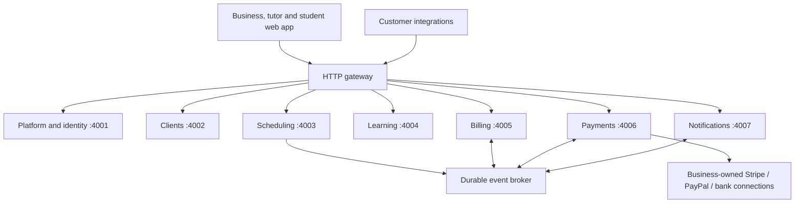

# Palladium Tutor Platform

A composable platform for independent tutors and tutoring businesses. Each business owns its clients, configures its features and branding, and collects payments through its own connected providers.

## Architecture commitment

**Every domain is an independently deployable service with its own database, migrations, API and lifecycle.** This repository is a monorepo for coordinated development; it is not one backend application. Services do not import each other's implementations or query each other's databases.

The web application is a client of the gateway. A feature is plugged into the app by registering its API route, navigation entry, required entitlement and supported configuration. Its business logic remains in its service. The same API can serve another frontend.

## Service ownership

| Service | Owns | Works without |
| --- | --- | --- |
| Platform | Sign-in, businesses, memberships, entitlements and branding | Every optional feature |
| Clients | Students, paying contacts and their relationships | Scheduling, learning, billing |
| Scheduling | Availability and session lifecycle | Learning and billing |
| Learning | Assignments, resource references and progress | Scheduling and billing |
| Billing | Invoices, invoice items and payment allocations | Scheduling; invoices may be created directly |
| Payments | Provider connections, payment attempts, verified provider notifications and refunds | Learning and scheduling |
| Notifications | Delivery requests, templates and delivery status | Any specific feature; subscribes to configured events |

The shared platform core is required by every feature. Optional cross-feature workflows are explicit subscriptions; enabling scheduling never implicitly enables billing. An invoice snapshots payer information, so historical billing does not depend on a live client record.

## Read these contracts before implementing a service

1. [Service boundaries and app composition](docs/architecture/services.md)
2. [HTTP authentication and communication](docs/architecture/http.md)
3. [Events, retries and data consistency](docs/architecture/events.md)
4. [Tenant isolation and customization](docs/architecture/tenancy.md)
5. [Payment provider contract](docs/architecture/payments.md)
6. [Implementation contract for contributors](docs/architecture/implementation.md)
7. [Architecture decisions](docs/architecture/decisions.md)

## Stack

TypeScript; Next.js/React web client; individual NestJS services; PostgreSQL database and restricted database role per service; RabbitMQ for durable event delivery; Docker Compose for local deployment. Shared packages contain wire contracts and infrastructure helpers only. Payment SDKs stay in the payment service.

Production provider credentials, country-specific bank connectors, and cloud deployment are separate configuration and integration work. A sandbox or manual bank-payment record must never be described as a live, automatically reconciled payment.

## Build status

Architecture is the first committed deliverable. Service implementation, local setup instructions and verified checks will be added in subsequent commits. This repository is initially private; no open-source license has been granted.
