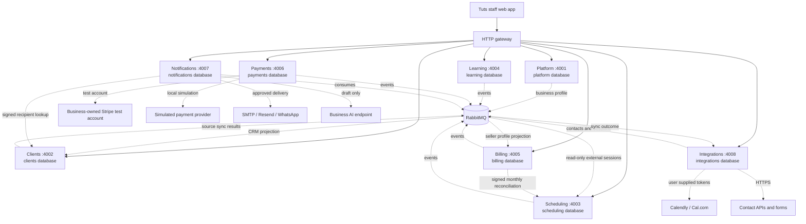

# Tuts

Tuts is a composable tutoring-business workspace. Its local preview brings together eight independently running domain services, each with its own API, migrations, and PostgreSQL database. PostgreSQL row-level security, signed gateway context, and RabbitMQ provide the service and tenant boundaries.

The current product is a staff web app with a local preview, a container deployment configuration, and a Cloudflare runtime adapter. The hosted app is available at [tuts.palladiumscholars.com](https://tuts.palladiumscholars.com), with page visits to [tuts-palladium.pages.dev](https://tuts-palladium.pages.dev) redirecting to the custom domain. Live checks confirmed the custom hostname homepage, health endpoint, unauthenticated session endpoint, and canonical redirect. Hosted signup/sign-in and authenticated workflows remain unverified. See the [Cloudflare deployment guide](docs/cloudflare-deployment.md), [domain setup](docs/cloudflare-domain.md), and [agent tooling setup](docs/agent-setup.md). Architecture documents describe the contracts and extension workflow for this system; they include planned capabilities as well as implemented ones. The status list below is the source of truth for what is delivered today.

The original local account and four owned workspaces have been restored to the hosted databases, including CRM, sessions, learning and billing records. See [data migration and recovery](docs/data-migration.md) for the backup, maintenance and integrity checks. Existing passwords were preserved; old browser sessions were not transferred.

## What works today

| Area          | Delivered                                                                                                                                                                               | Not delivered yet                                                                                            |
| ------------- | --------------------------------------------------------------------------------------------------------------------------------------------------------------------------------------- | ------------------------------------------------------------------------------------------------------------ |
| Platform      | Sign-in, business workspaces, an owner membership created with each workspace, editable business profile and address, logo, four-color workspace palette                                | Inviting or adding other staff, student/parent portal, production subscription administration                |
| Clients       | Tenant-scoped student/payer CRM; custom typed columns, filters, sorting and bulk selection; mapped CSV/`.xlsx` import; connected-source intake and email/WhatsApp permissions           | Student/parent portal access                                                                                 |
| Scheduling    | Month and week calendars with synced Calendly/Cal.com bookings, date navigation, daily agenda, and booking details; legacy local session APIs remain                                    | UI-based local session creation/editing and provider booking actions; student self-service booking           |
| Learning      | Calendar/date-time picker; staff assignments, progress records, and private disk/R2 resource uploads up to 20 MiB                                                               | Student/parent portal access; hosted R2 upload/download flow unverified                                                        |
| Billing       | Monthly arrears drafts from completed classes, student rates, optional draft automation, revenue/class dashboard; staff invoice creation, issue and allocation with seller profile/logo | Automatic issuance/charging, fixed packages, taxes and hourly pricing                                        |
| Payments      | Stripe test-account connections, hosted test payment links, verified server reconciliation; local sandbox simulation                                                                    | Production Stripe Connect/OAuth, PayPal, bank providers and signed external webhooks; no real money is moved |
| Notifications | Email (SMTP/Resend), WhatsApp template and AI drafting connections; recipient previews, permission checks, approved durable campaigns; local delivery disabled                          | Provider delivery/read receipts, SMS, student portal; actual outbound delivery not exercised                 |
| Integrations  | Token-based Calendly/Cal.com polling, HTTPS JSON contact pulls, authenticated form webhooks, durable CRM/session sync                                                                   | OAuth app connections; businesses must supply credentials and verify their own connection before use         |

The [Cloudflare deployment guide](docs/cloudflare-deployment.md) describes separate private service Workers, PostgreSQL databases, Queues and private R2 uploads. Its adapter preserves the HTTP and event contracts. SMTP, arbitrary contact API pulls and custom AI endpoints require an additional safe egress adapter on Cloudflare; Cal.com, Calendly, Resend and WhatsApp use fixed provider endpoints. Production payments remain unavailable, and outbound messaging is disabled by default. The hosted homepage, gateway health, unauthenticated session endpoint, and canonical redirect respond successfully; hosted signup/sign-in and authenticated workflows remain unverified. The earlier [Google Cloud container configuration](docs/deployment.md) remains an alternative and has not been provisioned.

OAuth app connections, production payment providers, country-specific bank integrations, student/parent portal access and paid subscription administration are future work. Provider integrations require each business to supply its own credentials; their live behavior has not been verified as part of this implementation. See [connector protocols](docs/architecture/connectors.md), [payment provider contracts](docs/architecture/payments.md), and the [service status list](#what-works-today).

## Architecture



Each service owns its database, migrations, and API. PostgreSQL row-level security and signed gateway JWTs scope business requests. RabbitMQ carries cross-domain events in the Node deployment; the Cloudflare adapter uses per-consumer Queues with the same contracts. The integrations service polls connected calendars and receives contacts, then the CRM and scheduling services own their projections. Payments creates test links in each business’s own Stripe test account; verified reconciliation flows into Billing through events. Notifications resolves selected CRM recipients over signed HTTP and owns its campaign queue.

## Quickstart

Prerequisites: Node.js 22 or newer, pnpm 10, and Docker with Docker Compose.

From the repository root:

```sh
pnpm install
pnpm setup:local
pnpm infra:up
pnpm build
pnpm dev
```

`pnpm setup:local` creates an ignored `.env` with local credentials and signing keys, and adds missing settings while preserving existing values. Keep it on your machine. Account signup requires an 8–128 character password and a confirmation in the UI; there are no composition rules. Creating a business workspace creates its owner membership. `pnpm infra:up` starts the local PostgreSQL server and RabbitMQ. `pnpm dev` runs the eight services, gateway, and web app; leave it running while using the preview.

For an existing checkout, use the same commands after pulling the update. Run `pnpm install` to update the workspace, then `pnpm setup:local` to add the integrations encryption key and database credential while preserving existing local settings. After starting infrastructure, run `docker compose exec -T postgres sh /tmp/palladium-init.sh` once; this idempotently provisions the new integrations role and database without resetting existing databases. Then build and start the development processes:

```sh
pnpm install
pnpm setup:local
pnpm infra:up
docker compose exec -T postgres sh /tmp/palladium-init.sh
pnpm build
pnpm dev
```

Messaging needs `COMMUNICATIONS_ENCRYPTION_KEY` and defaults to `ALLOW_OUTBOUND_DELIVERY=false`; preview/approval and provider wiring are documented in [communications](docs/architecture/crm-communications.md). Keep its encryption key stable.

The integrations service needs `INTEGRATIONS_ENCRYPTION_KEY`, generated by `pnpm setup:local` as canonical base64 for 32 random bytes. Keep the key stable; changing it requires reconnecting providers whose credentials it encrypted.

- Web app: [http://localhost:3000](http://localhost:3000)
- Gateway: [http://localhost:8080](http://localhost:8080)
- RabbitMQ management: [http://localhost:15673](http://localhost:15673)

Stop the app with Ctrl-C, then stop infrastructure with `pnpm infra:down`. Fresh installations provision all service databases and roles when the PostgreSQL volume is initialized. The setup script preserves an existing `.env`; changing generated database passwords later does not rotate passwords in an already initialized database. `docker compose down -v` deletes all local PostgreSQL, RabbitMQ, and learning-upload data, including workspaces and records.

## How features plug in

The web app composes business features through the gateway. A feature owns its business logic and data in its service; frontend navigation is only a presentation choice, while the gateway and service enforce access. For the end-to-end workflow, start with [service boundaries and app composition](docs/architecture/services.md#composition), then follow its [feature addition steps](docs/architecture/services.md#add-a-feature). The [HTTP](docs/architecture/http.md), [events](docs/architecture/events.md), [tenant isolation](docs/architecture/tenancy.md), and [implementation](docs/architecture/implementation.md) documents define the shared contracts.

Read the contracts before extending a service:

1. [Service boundaries and feature composition](docs/architecture/services.md)
2. [HTTP authentication and communication](docs/architecture/http.md)
3. [Events, retries, and consistency](docs/architecture/events.md)
4. [Tenant isolation and customization](docs/architecture/tenancy.md)
5. [Payments and provider capabilities](docs/architecture/payments.md)
6. [Contributor implementation contract](docs/architecture/implementation.md)
7. [Architecture decisions](docs/architecture/decisions.md)
8. [Connector protocols, sync APIs, and event flow](docs/architecture/connectors.md)
9. [CRM columns and communications](docs/architecture/crm-communications.md)
10. [Monthly billing and dashboard](docs/architecture/monthly-billing.md)

These pages preserve the intended architecture and clearly scoped future requirements; they do not assert that every described capability is implemented. Check **What works today** above and each service README for current service behavior.

The [live UI review](docs/ux-review.md) records usability fixes, manually exercised flows, and verification limits.

## Stack

TypeScript, Next.js and React, eight NestJS service processes, PostgreSQL with a separate database and restricted role per service, RabbitMQ, and Docker Compose for local infrastructure. The local Compose environment shares one PostgreSQL server while keeping the service databases and credentials separate. The Cloudflare target uses private Workers, Neon PostgreSQL, Queues and R2 while retaining the same domain boundaries. Payment simulation is limited to the local development environment.
