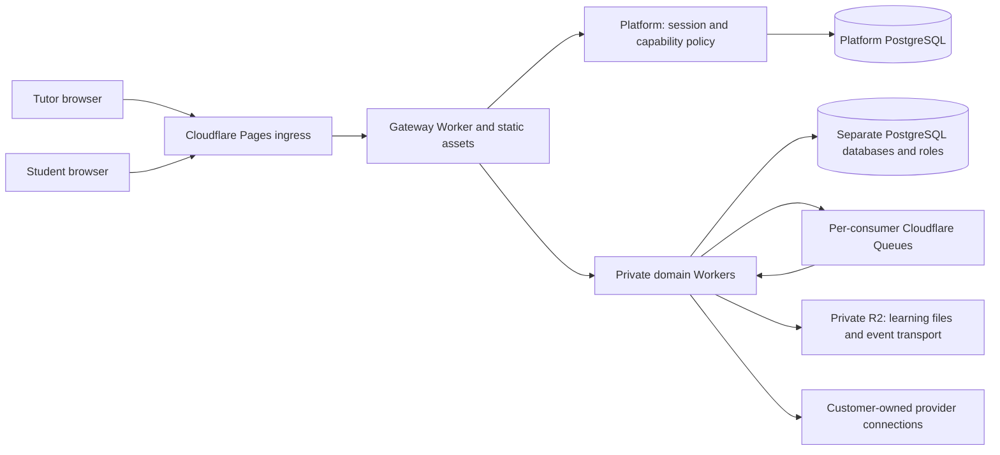

# Current system architecture

Baseline: application `2a44213`, inspected 10 October 2026. This page describes existing behavior; proposed changes are explicitly named. [API/schema inventory](../service-inventory.md) and [audit](../reviews/2026-10-10-platform-audit.md) provide implementation references and verification limits.

## Deployment



Production has **ten domain Workers plus one gateway**, Pages ingress, ten Neon PostgreSQL databases/roles, consumer/dead-letter queues and two private R2 buckets. Domain Workers are private; browsers access the gateway. All ten domain Workers have targeted placement; the manifest specifies the London database region. No inspected Worker has a Hyperdrive binding. This is one monorepo with independent deployable services, not one shared business application/database.

Local development substitutes ten Node/Nest processes, a Node gateway, Next development server, PostgreSQL databases/roles on one server, RabbitMQ and private disk files. The container deployment is an alternative; it is not the current hosted target. Production Next output is static: no Next server actions own persistence.

## Domain ownership

| Owner | Authoritative data and behavior | Integration surfaces |
| --- | --- | --- |
| Platform | Accounts, hashed passwords, sessions, businesses, branding, memberships, permissions, scoped portal grants and invitations | Private context verification; business-profile events; dedicated system-mail HTTP |
| Clients | Canonical students/clients, related contacts with multiple addresses, payer links, custom fields, imports, source identities, aliases, groups and education profiles | Contact ingestion events; merge events; scoped student snapshots; student-count aggregate |
| Scheduling | Native/external sessions, provider booking references, linked student IDs, explicit attendance, completed/cancelled/no-show ledger | Calendar sync events; class-update events; bounded portal attendance API |
| Learning | Assignments, submission/review state, private upload metadata/files, resources and selected Google Docs essay links | Revisioned assignment/resource events; scoped upload/download endpoints |
| Billing | Seller snapshots, rates, completed-class billing, native invoices, payment allocations, historical files/work/invoice declarations and financial aggregates | Class/profile/payment/merge events; authenticated analytics and finance APIs |
| Payments | Business payment connections, provider attempts and verified provider state | Invoice-issued projection and payment-confirmed events; test-only adapters today |
| Notifications | Communication connections, campaign approval/recipient snapshots/delivery state, system-mail provider adapter | Event consumers; authorized CRM recipient lookup; private auth-mail HTTP |
| Integrations | Encrypted calendar/contact connection credentials, polling cursors, webhook receipts and booking configuration | Provider HTTP; contact/session/disconnect events; safe booking link API |
| Planning | Boards, columns, cards, checklists, sharing and versioned deadline templates | Student merge events; education profile supplied through API composition; revisioned move API |
| Reporting | Rebuildable class/learning/finance projections, coverage, first-party activity, attribution links/clicks | Revisioned events; bounded source reconciliation; dashboard composition over Clients/Billing HTTP |

The gateway owns ingress security, trusted context issuance, routing, canonical origin, maintenance and diagnostic timing. The web app owns interaction state, screen composition and short-lived per-business caches. `contracts` owns wire types/events/capabilities; `service-kit` owns transport, guards, database transactions, diagnostics and outbox/inbox primitives. Neither shared package owns domain repositories.

## Requests and consistency

```mermaid
sequenceDiagram
  participant UI as Web app
  participant GW as Gateway
  participant P as Platform
  participant S as Domain service
  participant DB as Its database
  participant Q as Consumer queues
  UI->>GW: Cookie + selected business + API request
  GW->>P: Verify session, membership and capability policy
  P-->>GW: Verified role, permissions and student scope
  GW->>S: 60-second signed context
  S->>DB: BEGIN; set tenant locally; domain SQL
  Note over S,DB: Mutation and event outbox commit together
  DB-->>S: COMMIT
  S->>Q: Flush committed events
  Note over S,Q: Current HTTP adapter awaits this on successful reads too
  S-->>UI: JSON or bounded file response
```

Synchronous composition uses private service bindings on Cloudflare and configured URLs on Node. Forward the verified caller token; never replace it with an unrestricted service user. Other-service identifiers are opaque references, not SQL foreign keys across databases. Cross-service joins/imports are forbidden and checked by `pnpm check:boundaries`.

Events use the same versioned envelope on RabbitMQ/Queues. Producer mutations and outbox writes are atomic. Fanout is at least once; destination inbox writes and domain effects commit together. Duplicate delivery is expected. Queue consumers, request publication and 15-minute private scheduled ticks recover pending outboxes. Larger event payloads use private R2 pointers with digest/identity checks; their seven-day expiry makes timely recovery operationally important. Business display projections may lag their source; invoice issue snapshots and payment allocations have stronger local transaction rules.

## Main workflows

### CRM and imports

One student can have several related contacts and several addresses per contact. Manual merge selects the survivor and resolves conflicts; retaining another address requires an explicit choice. Names alone are duplicate signals, not proof of identity. Source identifiers and exact matching rules support ingestion; ambiguous names require review. A merge preserves the old ID as an alias and emits updates to dependent projections. Issued invoices keep their original financial/recipient snapshots. Portal authorization is never silently transferred by a merge.

CRM CSV/XLSX import is distinct from Billing history import. Billing preserves source bytes, columns, formulas and row provenance, stages a preview, and commits reviewed normalized rows idempotently. PDFs are archived with reviewed metadata; OCR is not implemented. Work rows and imported invoices remain separate from native invoices and processor-confirmed collections. See [history semantics](business-history-analytics.md), especially case-insensitive status interpretation and currency defaults.

### Groups, portal and learning

Groups belong to Clients; selecting unassigned students uses server filters. Portal access belongs to Platform and requires explicit student grants. Adding students can request invitations through the separate system sender, with a verified production sender now enabled. Live password-recovery delivery is confirmed; this release did not send a real student invitation. Tutor cards compose CRM, Reporting and optional financial data. Student screens show homework, resources/essays, booking, sessions and planning. **Tutor billing, financial summaries and administrative activity reporting are excluded from student access by backend policy.** Google Docs links are validated references; Google controls document sharing/editing. Tuts does not measure time in an external Google document.

### Calendars and billing

Integrations imports Cal.com/Calendly bookings. Scheduling owns normalized session/attendance records; elapsed time is not completed attendance. Students open tutor-configured safe booking links; this is not a new Tuts booking engine. Billing reconciles completed classes and drafts the previous month's invoice on the first of the following month. Issuing/charging is separate from drafting. Imported historical status is a customer declaration; it is not a Stripe receipt.

### Planning

Students/tutors can create multiple independent boards. Education profile drives relevant application cycles. Templates include dated suggested milestones, provenance and university/program-specific confirmation flags. Typical US deadlines are planning defaults, not universal university deadlines. Existing boards expose an explicit template upgrade; student edits remain protected. Whole cards drag, local moves render immediately, and ordered per-board saves run in the background with revision/conflict handling. Backend persistence remains in Planning; optimistic UI is not permission to skip server validation.

### Analytics

Dashboard overview requests Reporting once; Reporting reads Clients counts and Billing aggregates in parallel over HTTP. Tracker summary batches resolve up to 100 students with four SQL statements, or five with finance, rather than one source request per student. A separate explicit reconcile operation can fan out to historical source APIs. Coverage, timestamps and nulls distinguish missing data from zero.

Imported engagement is currently keyed by source student names; it is not fully linked to canonical CRM IDs. Churn is previous-month inactivity, provisional in an incomplete month. Expected revenue is recorded work value or separately labelled native scheduled-class estimates, not a predictive model. Currencies remain separate and simulated payments are excluded. See the audit before using these measures for automated decisions.

## Customization and future hierarchy

Provision by **capabilities and resource scope**, not role labels in UI. Platform owns `permissions_override`, `access_scope`, student grants and feature entitlements; gateway signs the resolved policy. Domain endpoints enforce explicit action permissions plus tenant/student access. Business branding/custom columns are data, not customer code execution.

A future enterprise account can assign billing/reporting permissions to its administrators and teaching permissions to its tutors without moving Billing into the enterprise UI/database. Enterprise hierarchy, licenses, delegation and organization-wide reporting are **not implemented**. Future design must explicitly define parent/child organizations, trusted scope expansion, financial ownership and revocation. A parent account must not gain child-tenant access through a UI switch or by passing a different business ID.

Add a feature by defining owner, API/event/schema, capability/scope, runtime bindings/migrations, UI registry and failure behavior. Update inventory/contracts/tests/docs together. Shared transport changes affect all services and require separate compatibility review; they do not justify shared business persistence.
