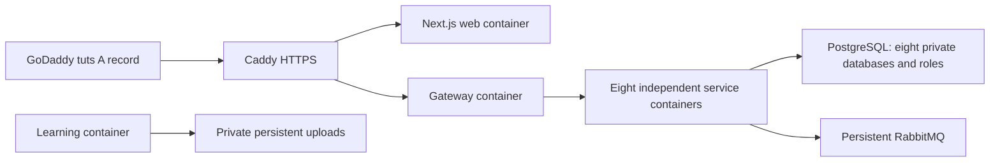

# Tuts hosting on Google Cloud

Target: `https://tuts.palladiumscholars.com`.

## Current status

Deployment configuration is implemented. The production web image starts and serves HTTP successfully; Compose and Caddy configuration validation pass. On October 4, 2026, provisioning was blocked because `palladiumscholars-firebase` had no enabled billing account and the only accessible billing account was closed. This document does **not** claim that the domain is live. Update this section with the deployed revision and verification results after deployment.

## Topology

The initial deployment uses one dedicated Debian 12 Compute Engine VM in `europe-west1-b`, with 2 vCPUs, 8 GiB RAM and an 80 GiB persistent boot disk. Each of the eight domain services, the gateway and the web app has an independent container/image. Databases retain separate roles, passwords, migrations and tenant RLS. Sharing a host does not change the application service boundaries. This initial host is a single availability boundary; independent hosts or managed databases can replace components through the existing HTTP/event contracts.



Only ports 80/443 are public. SSH is reachable through Google IAP's address range; database, broker, management UI, domain APIs and gateway have no host port bindings. An internal Docker backend network contains storage/services. Only the integrations, notifications and payments containers have a separate provider egress network. Caddy and the composition app/gateway share an edge network.

Caddy handles TLS issuance/renewal, HTTP redirects, a 25 MB request limit and security headers. It overwrites `X-Real-IP` before proxying to the gateway. Platform authentication uses that header for rate limiting and deployment-configured HTTPS URLs for cookie/security decisions; forwarded host/protocol are not trusted. The browser and gateway use the same HTTPS origin. The frontend gateway URL is baked into the production build, never set to localhost at runtime.

## Provision and deploy

1. Sign in with `gcloud auth login omar@palladiumscholars.com`. Enable billing for `palladiumscholars-firebase` using an active billing account. Account/payment activation is a human action.
2. Commit the complete source revision. The deployment script rejects an uncommitted tree; it uploads a `git archive`, excluding ignored credentials, local data and build outputs.
3. Run `bash scripts/deploy-gcp.sh`. Optional overrides: `TUTS_GCP_PROJECT`, `TUTS_GCP_REGION`, `TUTS_GCP_ZONE`, `TUTS_GCP_VM`. Region and zone must match.
4. The script enables required APIs, creates a dedicated VPC/subnet, static IP, narrowly scoped web/IAP firewall rules, a daily snapshot schedule and a VM with deletion protection. The VM has no application service account. Docker is installed through its signed official Debian package repository.
5. A root-only release lives in `/opt/tuts/releases/<commit>`. Production credentials are freshly generated on the VM into `/opt/tuts/.env.production` with mode 0600. Existing credentials are preserved on later releases. No local accounts, contacts, invoices or provider credentials are copied to production.
6. The release builds independent service images sequentially, starts services with health checks and restart policies, switches `/opt/tuts/current`, records `/opt/tuts/RELEASE`, and installs the daily backup timer.
7. Add the script's returned static IPv4 address as the GoDaddy `A` record named `tuts`, TTL 600. Review existing `tuts` A/AAAA/CNAME records first and change only this subdomain. Root website, www, mail and verification records must retain their existing values.
8. Verify authoritative DNS, a valid public TLS certificate, web/static assets, registration, login/session cookies, workspace creation and access to entitled service views through the public domain. Do not report deployment complete until this succeeds.

## Production feature policy

`INITIAL_BUSINESS_ENTITLEMENTS` is an explicit platform server setting. The deployment grants the seven implemented product features to newly created businesses. Setting it to an empty string grants none; unspecified production deployments default to none. Browser requests cannot set grants, and this setting does not retrofit existing businesses.

All domain services run with `NODE_ENV=production`. Sandbox simulation is disabled. Live Stripe/OAuth/PayPal/bank payment execution remains unimplemented; hosting does not enable test-only Stripe actions in production. Invoice accounting, monthly draft billing and recorded payment allocations remain available.

`ALLOW_OUTBOUND_DELIVERY=false` initially. Sender connections and campaign review work, but email/WhatsApp sending stays disabled until explicitly enabled by the operator and verified using their providers. Hosted calendar/contact connectors need business-owned credentials. Existing encrypted credentials and encryption keys must be restored together.

## Backups, upgrades and rollback

The systemd timer runs a database-by-database `pg_dump` and upload archive daily at 03:15 UTC, keeping 14 complete daily backups under `/var/backups/tuts`. It also preserves production keys/configuration and the release identifier, readable only by root. Google disk snapshots run daily at 04:00 UTC with 7-day retention; local backups alone do not protect against loss of the disk. Initial deployment and upgrades take a backup. Scheduled backups/snapshots and a restoration exercise require verification after provisioning; configuration alone is not evidence of recoverability.

Inspect with:

```sh
gcloud compute ssh tuts-app --project palladiumscholars-firebase \
  --zone europe-west1-b --tunnel-through-iap
sudo docker compose --env-file /opt/tuts/.env.production \
  -f /opt/tuts/current/compose.production.yaml ps
sudo systemctl list-timers tuts-backup.timer
sudo cat /opt/tuts/RELEASE
```

Do not print `.env.production` or a resolved Compose configuration into logs. Use `config --quiet` for configuration validation. Docker logs rotate at 10 MB with three files per container. Credentials are mounted nowhere in the web app or Caddy.

Deploy the next committed revision with the same script. Persistent volumes and signing/encryption keys remain in place. Keep old image tags and source releases until the new release is verified. For an application rollback, select the previous release and its image tag, then restart Compose without volume deletion. Migrations are forward-only: review database compatibility before rolling back code. For incompatible migrations, restore databases, uploads and the matching configuration from a consistent backup into an isolated environment before changing the live host.

Do not run `docker compose down -v`, delete retained disks, or remove encryption keys as a deployment step.

## References

- [Compute Engine VM creation](https://docs.cloud.google.com/compute/docs/instances/create-start-instance)
- [Docker's Debian installation](https://docs.docker.com/engine/install/debian/)
- [Caddy automatic HTTPS](https://caddyserver.com/docs/automatic-https)
- [Google billing account reopening](https://docs.cloud.google.com/billing/docs/how-to/close-or-reopen-billing-account)
- [Compute Engine pricing](https://cloud.google.com/products/compute/pricing/general-purpose)
